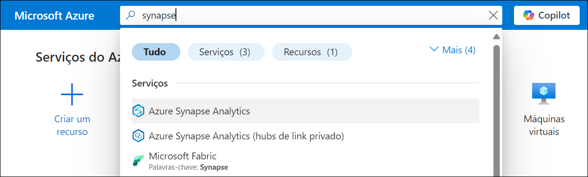

# Exercício 3: Criar uma aplicaçáo Open AI em Python

### Duração estimada: 60 minutos

Neste laboratório, os participantes desenvolverão uma aplicação usando APIs da OpenAI e a linguagem de programação Python. O objetivo é demonstrar como implementar funcionalidades de IA, como geração de linguagem, análise de sentimento ou sistemas de recomendação usando Python, aproveitando os poderosos modelos e ferramentas da OpenAI.

1. Pesquise e selecione **Azure Synapse Analytics** no portal do Azure.

      

1. Na janela **Azure Synapse Analytics** selecione **asaworkspace<inject key="DeploymentID" enableCopy="false"/>**.   

1. Na lâmina **Overview** na seção **Getting started**, clique em **Open** para abrir o Synapse Studio.
     
     
    
1. Clique em **Develop (1)**, depois clique em **+ (2)**, e selecione **Import**.

    

1. Navegue até `C:\labfile\OpenAIWorkshop\scenarios\powerapp_and_python\python` e selecione `OpenAI_notebook.ipynb`, depois clique em **Open**.

     

1. Selecione **openaisparkpool** no controlo **Attach to**.

    

1. Execute o notebook passo a passo para concluir este exercício. Clique no botão **Run** ao lado da célula.

     

1. Em **1. Install OpenAI**, clique no botão **Run** ao lado das primeiras células e clique no botão **stop session**. Aguarde até que **Apache Spark pools** fique no estado stop. 

     

      > **Nota**: talvez seja necessário reiniciar o kernel para usar pacotes atualizados

1. Em **2. Import helper libraries and instantiate credentials**, substitua **AZURE_OPENAI_API_KEY** e **AZURE_OPENAI_ENDPOINT** pela sua API key e endpoint URL.

     
   
1. No Portal do Azure, navegue até ao **openaicustom-<inject key="DeploymentID" enableCopy="false"/>** resource group,  e selecione o **openai-<inject key="DeploymentID" enableCopy="false"/>** Azure OpenAI resource.

    

1. Em Resource Management, selecione **Keys and Endpoint (1)**, e clique em **Show Keys (2)**. Copie **Key 1 (3)** e **Endpoint (4)**, e substitua  **AZURE_OPENAI_API_KEY** e **AZURE_OPENAI_ENDPOINT** pela sua chave de API e URL do Endpoint no script..

   
     
    > **Nota:** Se você encontrar um erro "Openai module not found", digite `%` antes da **pip install** na célula Install OpenAI e execute novamente o notebook.

1. Em **2. Choose a Model**, substitua o valor **model** de **text-curie-001** para **demomodel**.

    

1. Em **temperature**, substitua o valor **engine** de **text-curie-001** para **demomodel**.

     

1. Em **top_p**, substitua o valor **engine** de **text-curie-001** para **demomodel**.

     

1. Para **n**, substitua o valor **engine** de **text-curie-001** para **demomodel**.

     

1. Em **logprobs**, substitua o valor **engine** de **text-curie-001** para **demomodel**.

     

1. Depois de executar o notebook com êxito, clique em **Publish all**.

     

1. Em seguida, clique em **Publish** para salvar as alterações.

    

## Resumo

Neste laboratório, você desenvolveu com sucesso um aplicativo implementando funcionalidades de IA, como geração de linguagem, análise de sentimento ou sistemas de recomendação usando Python, aproveitando os poderosos modelos e ferramentas da OpenAI.

### Você concluiu o laboratório com sucesso
